# Data Jobs Salary Dashboard & Analysis

## 📊 Project Overview

This portfolio project demonstrates how I used **Microsoft Excel to transform job-market data into an interactive salary dashboard and deeper data analysis**.

The project combines two complementary Excel projects:

1. **Salary Dashboard** — the primary project included in this GitHub repository.
2. **Data Jobs Salary Analysis** — an additional analysis project showcasing Power Query, PivotTables, charts, Excel functions, and the Excel Data Model.

Together, the projects demonstrate an end-to-end workflow from **raw data preparation → analysis → modelling → visualization → interactive reporting**.

### Key capabilities demonstrated

- Data cleaning and preparation
- Data transformation with **Power Query**
- Advanced Excel formulas and dynamic calculations
- **PivotTables & Pivot Charts**
- Excel **Data Model & measures**
- Interactive dashboard development
- Salary benchmarking and comparative analysis
- Geographic and employment-type analysis
- Job-market demand analysis
- Skills-demand and salary analysis
- Data visualization and storytelling

---

# 1. Salary Dashboard

## 🎯 Business Objective

The objective of the dashboard was to make a large job-market dataset easier to explore and use for **salary benchmarking and job-market analysis**.

The dashboard allows a user to select a:

- **Job Title**
- **Country**
- **Employment Type**

and dynamically explore the resulting salary and job-market metrics.

This turns a large dataset into a practical analytical tool for answering questions such as:

- What is the median salary for a particular role?
- How does salary vary across countries?
- Which employment types have higher salaries?
- Where are the most job postings being advertised?
- How does the selected role compare with other data-related positions?

---

## 📸 Interactive Dashboard

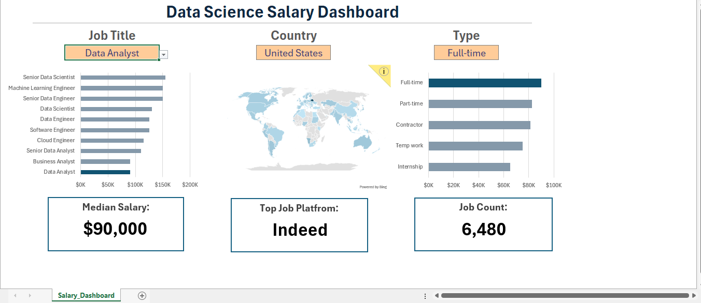

The dashboard combines interactive controls, calculated KPIs, and visual comparisons into a single reporting interface.

For the displayed dashboard selection, the analysis returns:

- **Median Salary:** $90,000
- **Job Count:** 6,480
- **Top Job Platform:** Indeed

The dashboard is designed so these outputs change according to the user's selections.

---

# 🗂️ Data Structure & Preparation

The dashboard is built from a dataset containing **32,672 job-posting records across 16 fields**.

The dataset contains information including:

- Job title
- Job title category
- Location
- Job platform
- Employment schedule
- Work-from-home indicator
- Search location
- Posted date
- Degree requirement
- Health insurance
- Country
- Salary rate
- Annual salary
- Hourly salary
- Company
- Skills

### Raw Data

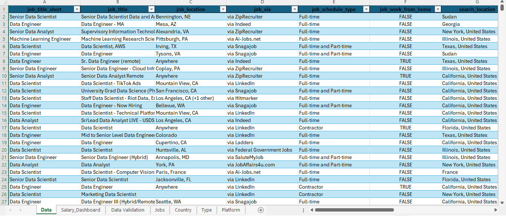

The raw-data worksheet provides the structured source table used by the dashboard calculations and analysis.

### Data Validation & Dashboard Controls

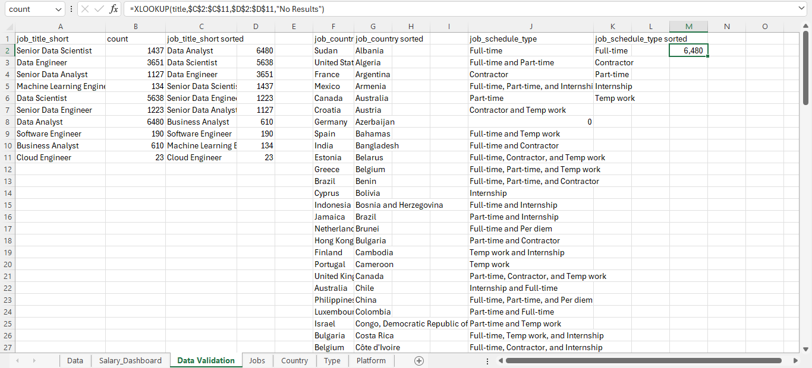

I used **data validation and named ranges** to create the interactive dashboard controls.

The selections are connected to named ranges such as:

- `title`
- `country`
- `type`

This allows user selections to flow through the workbook's calculations and update the dashboard dynamically.

---

# 🧮 Advanced Excel Functions

A key part of the project was building the dashboard using **formula-driven analysis rather than static outputs**.

Functions used include:

- `MEDIAN`
- `COUNT`
- `COUNTIFS`
- `IF`
- `SEARCH`
- `XLOOKUP`
- `UNIQUE`
- `SORT`
- `FILTER`
- `ISNUMBER`
- `SUBSTITUTE`
- `NA`

These formulas were used for:

- Conditional salary calculations
- Job-posting counts
- Dynamic filtering
- Lookups
- Ranking and sorting
- Creating dynamic lists
- Supporting dashboard chart outputs
- Handling invalid or missing salary values

This demonstrates practical experience using Excel formulas to build **dynamic, reusable analytical logic**.

---

# 💰 Salary Analysis by Job Title

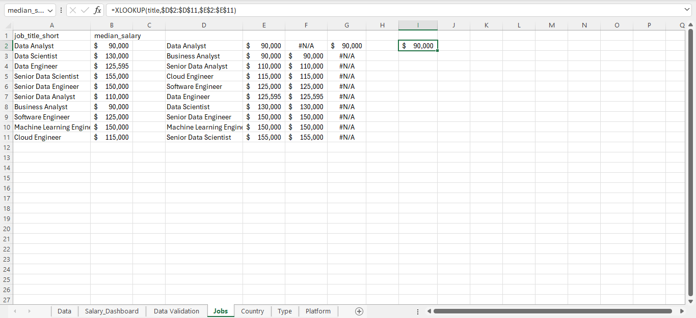

The workbook calculates and compares median salary across a range of data-related roles, including:

- Data Analyst
- Business Analyst
- Senior Data Analyst
- Cloud Engineer
- Software Engineer
- Data Engineer
- Data Scientist
- Senior Data Engineer
- Machine Learning Engineer
- Senior Data Scientist

I used conditional calculations and helper ranges to identify the selected job title and visually highlight it within the chart.

This creates a more interactive comparison than presenting a fixed salary ranking.

---

# 👔 Salary Analysis by Employment Type

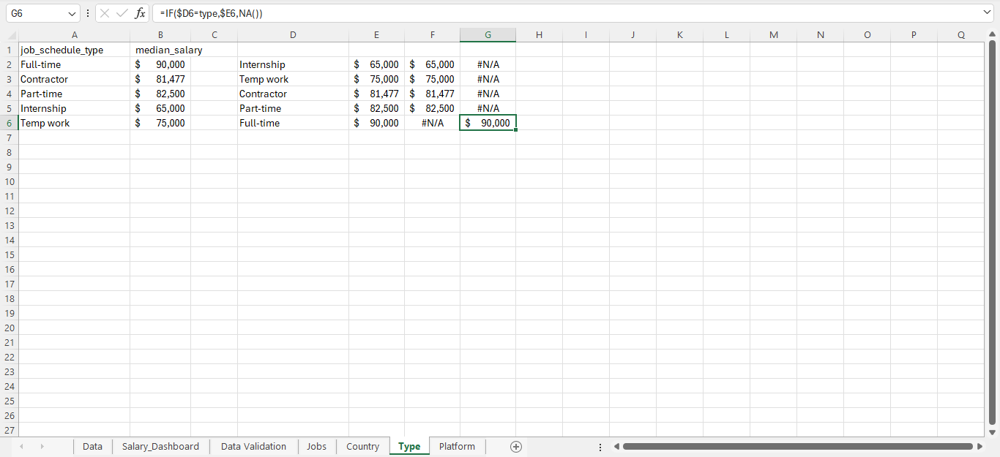

The dashboard compares median salary across different employment arrangements, including:

- Full-time
- Part-time
- Contractor
- Internship
- Temp work

The calculations dynamically respond to the selected job title and employment type, allowing compensation to be compared within the selected market segment.

---

# 🌍 Geographic Salary Analysis

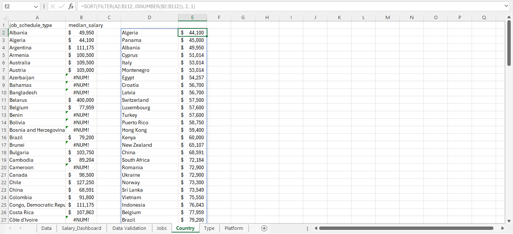

The country analysis calculates median salary across different countries while applying the dashboard's selected job-market criteria.

This provides a way to investigate **geographic differences in compensation** rather than relying on a single global salary figure.

---

# 💼 Job-Market & Platform Analysis

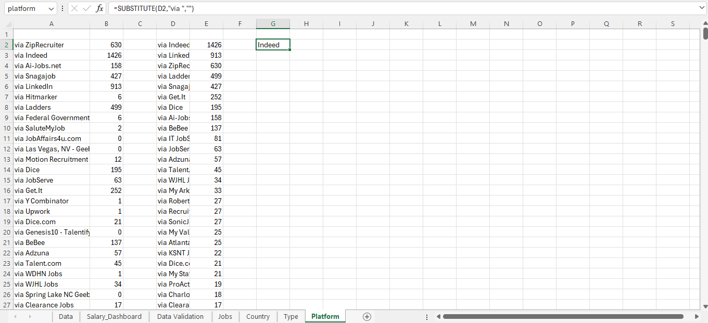

The project also analyses the volume of job postings by platform.

Using `COUNTIFS`-based calculations, the workbook dynamically counts postings according to:

- Job title
- Country
- Employment type
- Job platform

The results are then organized for visual comparison.

This adds a **job-demand dimension** to the salary analysis.

---

# 2. Additional Analysis — Data Jobs Salary Analysis

The second project extends the dashboard into a broader analytical workflow.

Analysis and screenshots are included here to demonstrate the additional work completed.

---

# 🔄 Power Query & Data Transformation

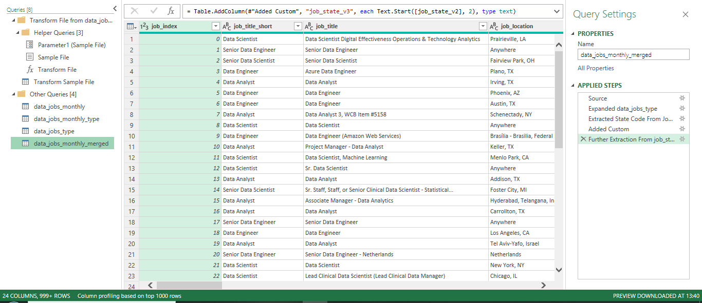

I used **Power Query** to work with the job and skills datasets and create a more structured, repeatable data-preparation workflow.

The workbook includes query connections for datasets such as:

- `data_jobs_all`
- `data_jobs_skills`

### Queries & Connections

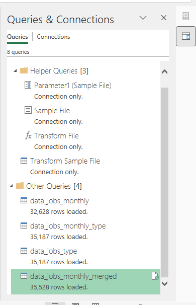

This demonstrates practical use of Power Query for:

- Importing data
- Transforming data
- Preparing datasets for analysis
- Maintaining query connections
- Separating job-level and skill-level data

---

# 📅 Job Posting Analysis

### Job Postings Over Time

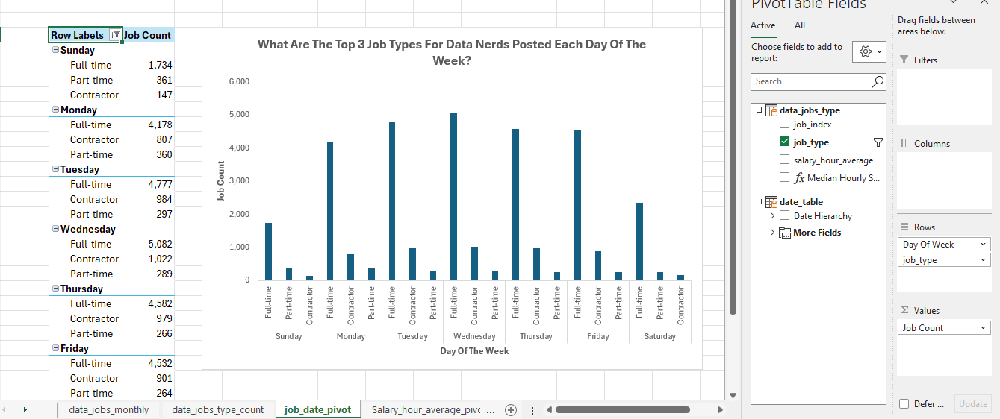

I used PivotTables to analyse job-posting volume over time and across job types.

This provides a way to explore how job-market demand changes across different periods and categories.

### Job Type Distribution

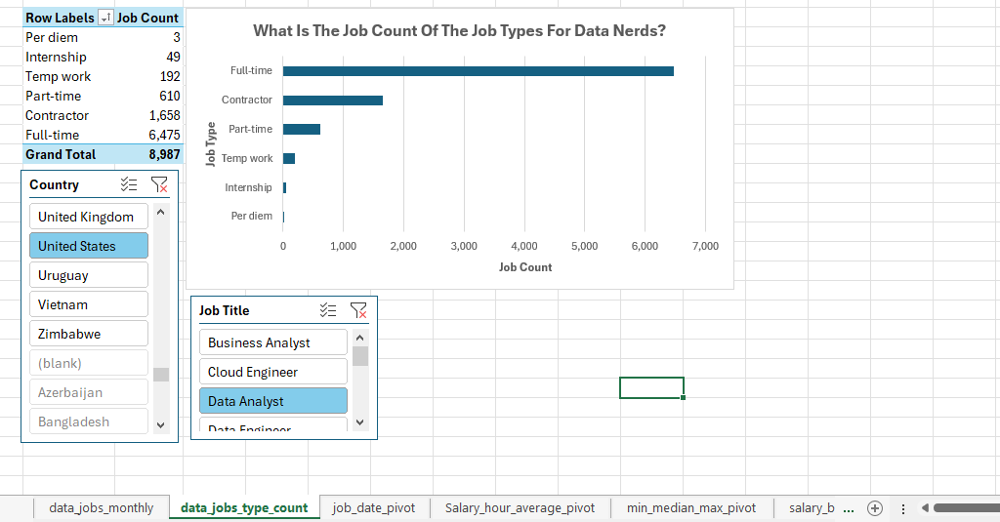

PivotTables and charts were used to compare job-posting counts across different job types, with filtering available by country and job title.

### Monthly Data

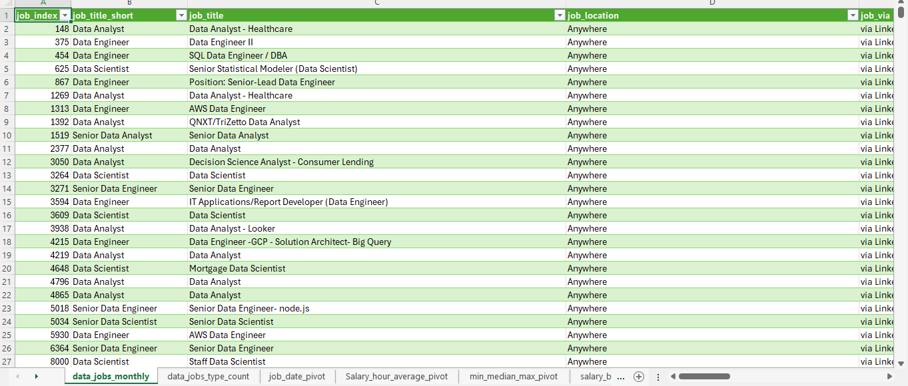

The monthly dataset supports the time-based analysis and provides the underlying detail for the PivotTable outputs.

---

# 💵 Salary Distribution & Compensation Analysis

### Minimum, Median & Maximum Salary

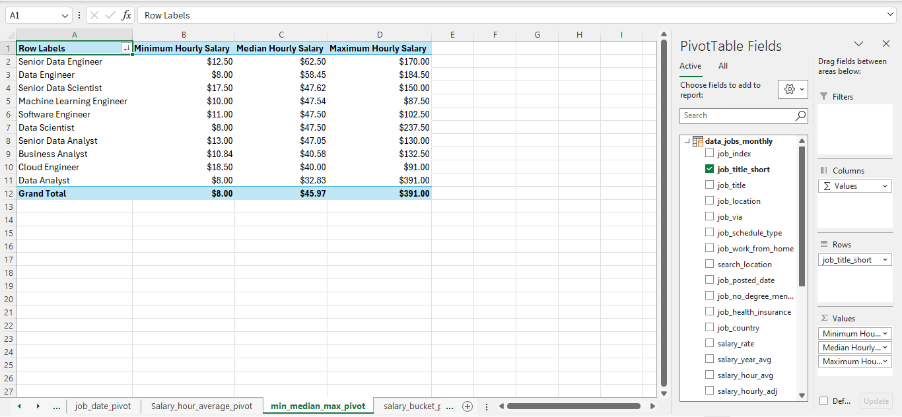

I used PivotTables to compare salary distributions across job titles using:

- Minimum salary
- Median salary
- Maximum salary

The **median** was particularly useful for benchmarking because it reduces the influence of extreme salary values.

### Cross-Filtered Median Salary

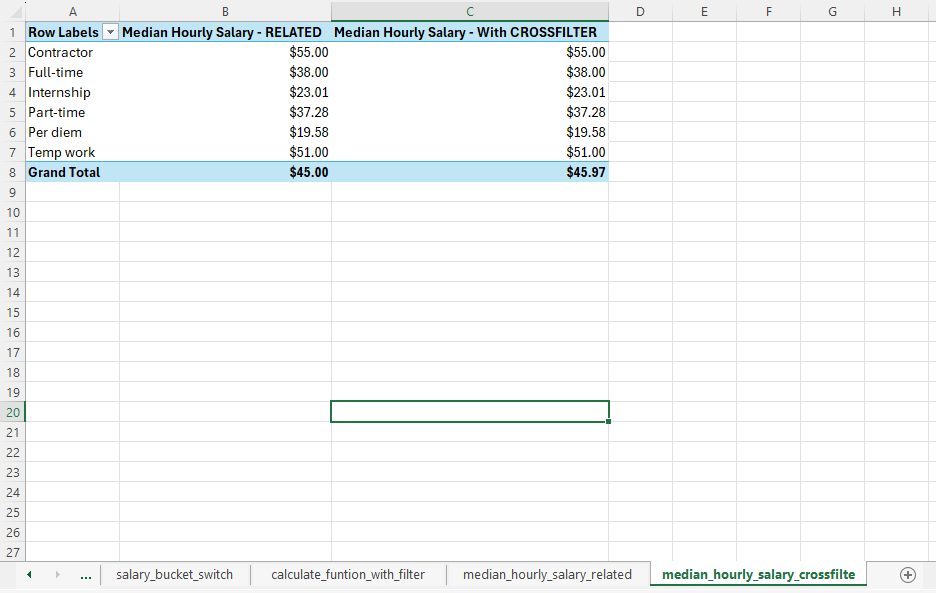

The workbook uses PivotTable filtering to compare median salary across different job categories and market segments.

### Salary Buckets

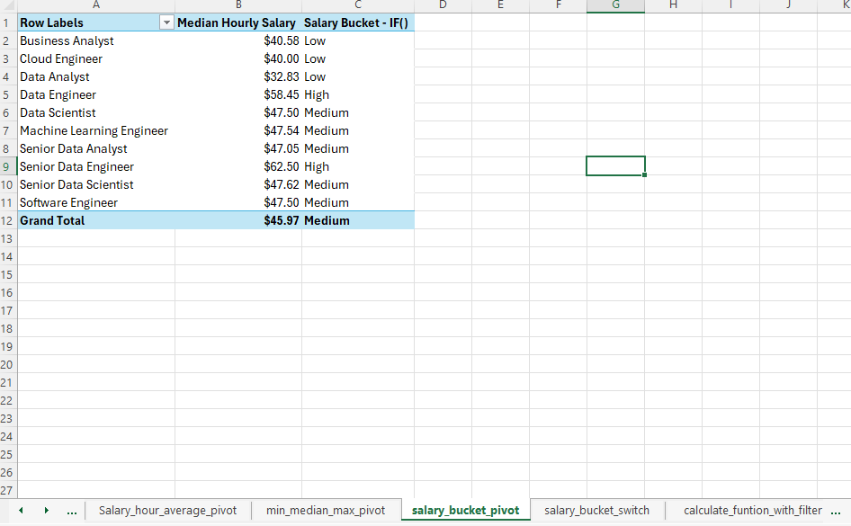

Salary values were grouped into compensation ranges to examine how jobs are distributed across different salary levels.

### Dynamic Salary Bucket Analysis

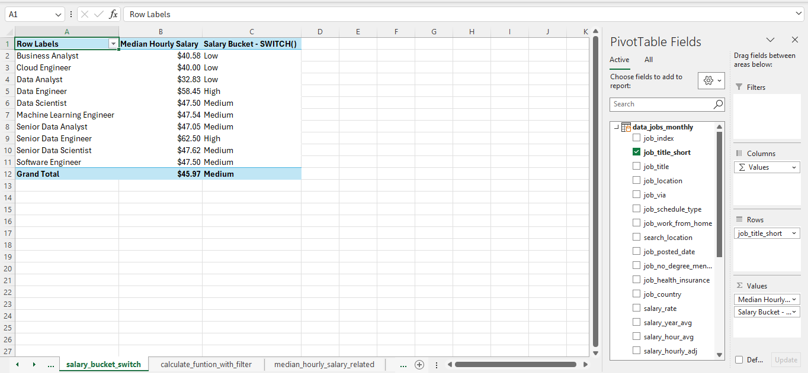

I also created a dynamic salary-bucket analysis to support alternative views of the compensation distribution.

---

# ⏱️ Salary & Hourly Rate Analysis

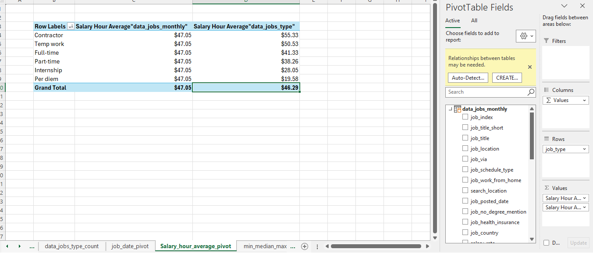

The project also analyses different compensation measures, including salary and hourly rates.

### Median Hourly Rate

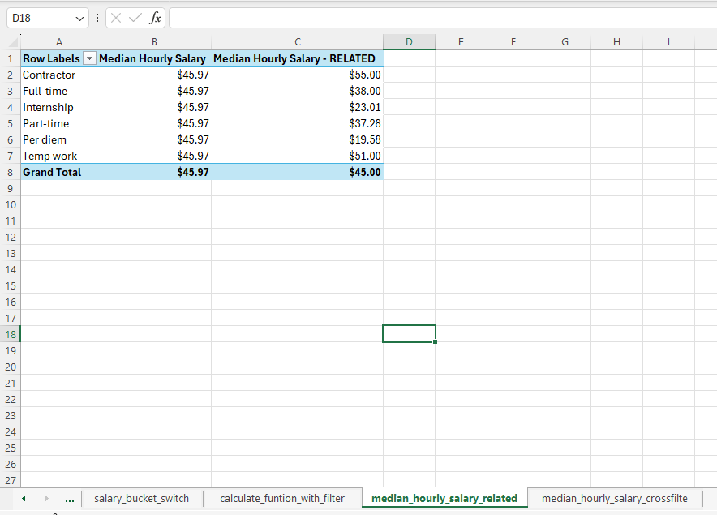

This demonstrates the ability to analyse compensation using different measures rather than treating all salary information as one metric.

---

# 🧮 Functions + PivotTable Analysis

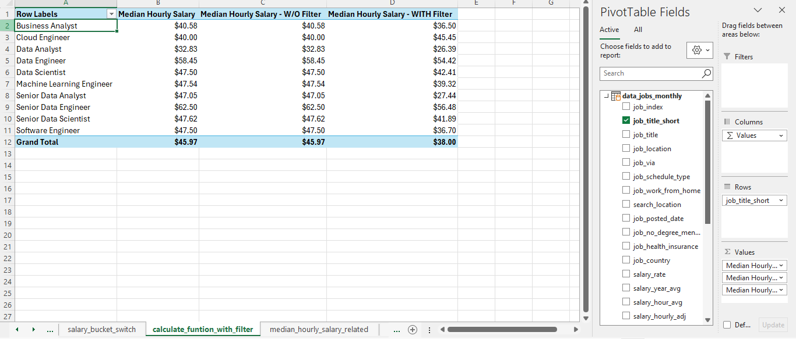

The second project combines **Excel formulas with PivotTable filtering** to answer specific analytical questions.

This demonstrates that I can use both:

- Formula-based analysis for targeted calculations
- PivotTables for flexible aggregation and exploration

rather than relying on only one Excel technique.

---

# 3. Skills & Salary Analysis

A major extension of the second project was analysing the relationship between **job skills, job demand, and salary**.

## 🧠 Salary vs. Skills Per Job

The analysis compares job titles using:

- Median salary
- Average number of skills associated with the role

Examples from the analysis:

| Job Role | Median Salary | Skills per Job |
|---|---:|---:|
| Senior Data Scientist | $155,000 | 5.26 |
| Senior Data Engineer | $147,500 | 8.14 |
| Data Scientist | $127,500 | 4.93 |
| Data Engineer | $125,000 | 6.96 |
| Senior Data Analyst | $111,175 | 4.35 |
| Machine Learning Engineer | $107,550 | 5.28 |
| Data Analyst | $90,000 | 3.60 |
| Business Analyst | $85,000 | 3.30 |

This analysis explores whether roles with broader skill requirements also tend to have higher compensation.

---

## 🌎 US vs. Non-US Salary Analysis

The project compares median salaries between **US and non-US markets** across different job categories.

This adds an important geographic dimension to the compensation analysis and allows the same job category to be compared across different markets.

---

## 🛠️ Data Engineer Skills Analysis

I analysed the skills most frequently associated with **Data Engineer** roles.

| Skill | Likelihood |
|---|---:|
| SQL | 49.1% |
| Python | 46.1% |
| AWS | 30.3% |
| Spark | 22.1% |
| Azure | 21.6% |
| Snowflake | 17.2% |
| Java | 16.4% |
| Hadoop | 12.2% |
| Kafka | 11.9% |
| NoSQL | 11.5% |

This extends the project from salary reporting into **skills-demand analysis**, providing insight into which technical skills appear most frequently within Data Engineer job postings.

---

# 💡 Skill Value Analysis

The analysis also combines **skill likelihood with median salary**.

| Skill | Median Salary | Skill Likelihood |
|---|---:|---:|
| Python | $98,500 | 28.8% |
| Oracle | $95,000 | 6.5% |
| Tableau | $95,000 | 28.4% |
| R | $92,513.75 | 16.1% |
| SQL | $92,500 | 52.4% |
| Power BI | $90,000 | 17.0% |
| SAS | $90,000 | 17.5% |
| Excel | $84,500 | 40.0% |

This provides a practical view of the relationship between **skill prevalence and compensation**.

---

# 🧰 Tools & Techniques

| Tool / Technique | Application |
|---|---|
| **Microsoft Excel** | Data analysis, calculations, modelling and dashboard development |
| **Power Query** | Data import, transformation and preparation |
| **Excel Data Model** | Analytical modelling and reusable measures |
| **PivotTables** | Data aggregation, comparison and exploration |
| **Pivot Charts** | Visual analysis and reporting |
| **Excel Functions** | Dynamic calculations, filtering, lookups and conditional analysis |
| **Data Validation** | Interactive dashboard controls |
| **Named Ranges** | Connecting dashboard selections to calculations |
| **Dynamic Arrays** | Automated filtering, sorting and list generation |
| **Charts & Dashboard Design** | Data visualization and storytelling |

---

# 📌 Skills Demonstrated

### Data Analytics

- Data cleaning and preparation
- Data transformation
- Exploratory data analysis
- Salary benchmarking
- Compensation analysis
- Job-market analysis
- Skills-demand analysis
- Geographic analysis
- Comparative analysis

### Excel & BI Skills

- Advanced Excel formulas
- Power Query
- Excel Data Model
- PivotTables
- Pivot Charts
- Dynamic filtering
- Data validation
- Named ranges
- Dashboard development
- Data visualization
- Data storytelling

---

# 📈 End-to-End Analytics Workflow

The combined projects demonstrate an end-to-end approach to Excel analytics:

**Raw job-market data**

→ **Data preparation & transformation**

→ **Power Query / Excel formulas**

→ **Data Model & PivotTables**

→ **Salary, demand & skills analysis**

→ **Charts & dashboard**

→ **Interactive business-focused reporting**

The key focus was not simply creating charts, but building the calculations and analytical structure behind them so the outputs could respond to different questions and filters.

---

# 🚀 Project Takeaway

This project demonstrates my ability to use **Excel as an end-to-end data analytics and business intelligence tool**.

I took a large job-market dataset and developed:

- An interactive salary dashboard
- Dynamic salary calculations
- Job-market and platform analysis
- Geographic salary comparisons
- Employment-type analysis
- Power Query data preparation
- PivotTable-based analysis
- Data Model measures
- Skills-demand analysis
- Salary-versus-skills analysis
- Data visualizations designed for decision-making

> **From raw job-market data to interactive insights — using Excel, Power Query, PivotTables, Data Modelling, formulas and visualization.**

---

